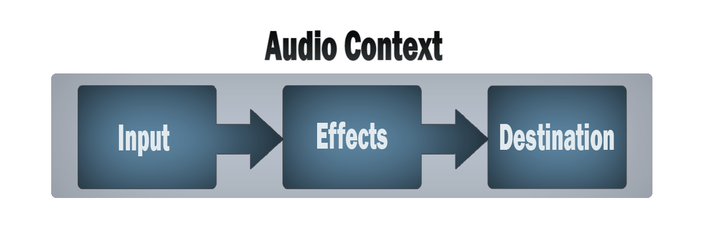

# What is the Web Audio API?

From [MDN](https://developer.mozilla.org/en-US/docs/Web/API/Web_Audio_API)

> "The Web Audio API provides a powerful and versatile system for controlling audio on the Web, allowing developers to choose audio sources, add effects to audio, create audio visualizations, apply spatial effects (such as panning) and much more."

The **Web Audio API** was designed to allow *modular routing*. What this means is that as the developer, you create and link together different **audio nodes** to create an **audio routing graph**.

Linking together different chains of audio nodes is what gives developers the flexibility to create complex audio effects.

## Basic Workflow

1. Create audio context
2. Create audio sources within audio context (this repo uses [OscillatorNode](https://developer.mozilla.org/en-US/docs/Web/API/OscillatorNode)s)
3. Create effects, such as reverb, biquad filter, or gain
4. Select final destination for audio
5. Connect sources to effects and effects to destination

